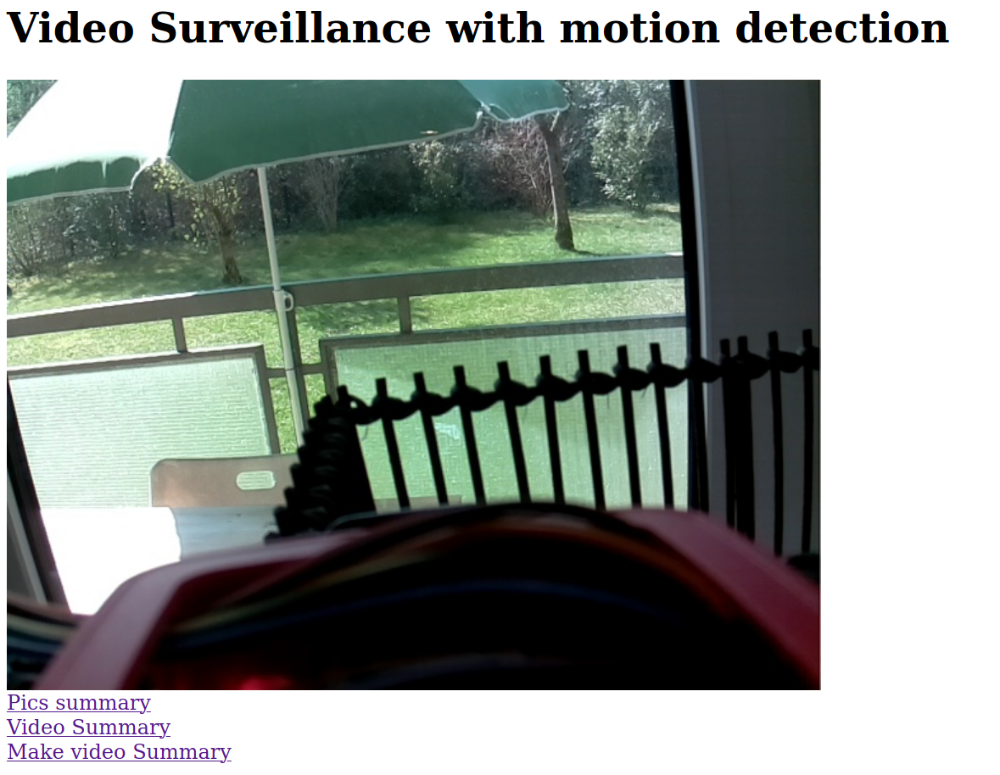

# Video surveillance using Raspberry PI or USB Camera and Flask

## Author 
Ruben Cardenes, PhD

## Description

This project starts a web server application with Flask that streams video from a camera. 
 It uses motion detection, shows the detected moving objects with red squares, and stores the frames with motion on disk with minimum time separation of 2 seconds. 
The web application allows to see the streaming video a summary of the moving pictures and creates a video summary of the current day.
 
 ## Project features 

- [x] Raspberry PI camera support
- [x] USB Camera support 
- [x] Multi-object motion detection for picture saving 
- [x] Web streaming 
- [x] Direct streaming scripts  
- [x] Picture gallery summary
- [x] Video summary creation from saved images 
- [x] People detection 



## Requirements

Python 3.6 

```
Flask==1.1.2
imutils==0.5.3
numpy==1.18.2
opencv-python>=3.4.6.27
tqdm==4.45.0
PyYAML==5.3.1
tensorflow-gpu==1.15.2
```

## Instructions 

1. Download the code:
```
git clone https://github.com/rubencardenes/survey_raspberry_pi.git
```

2. Install python requirements (preferably in a virtual environment) 
```
pip3 install -r requirements.txt 
```

For Raspberry PI, follow the instructions here for tensorflow installation:
```
https://qengineering.eu/install-tensorflow-1.15.2-on-raspberry-pi-4.html
```

3. Folder structure 

Make sure that you have a folder called "static" at the same level as the scripts. 
Inside static, you also need to have the folders "images" and "video_summary"
 
4. Start the script (by default on localhost in port 8887)
```
python3 start_flask.py &
```
The & at the end of the is not mandatory, but it makes the script to run on the background. 

5. Connect to the server from a browser:
```
http://localhost:8887
```

Notes: the main script usage is the following  

```
usage: start_flask.py [-h] [--port PORT] [--host HOST] [-p CAMERA_TYPE]
                      [--area AREA] [--delay DELAY]

optional arguments:
  -h, --help      show this help message and exit
  --port PORT     socket port
  --host HOST     destination host name or ip
  -p CAMERA_TYPE  use piCamera
  --area AREA     minimum detected area to save a frame
  --delay DELAY   minimum delay to save a frame again
```
## Extra

There are two extra scripts to do just video streaming:

- video_stream_receive.py
- video_stream_send.py  

Those ones do not use Flask, but send video signal directly to another PC. Can be useful for some applications. 
Important to know is that video_stream_receive.py acts as server and should be started first to start listening to incoming connections. 

## License 
This is opened with a MIT License, so use it as you want.    

## Acknowledgements

Some code for Flask integration and to do motion detection are taken from the great PyImageSearch blog by Adrian Rosebrock. 
Here some extra code  

